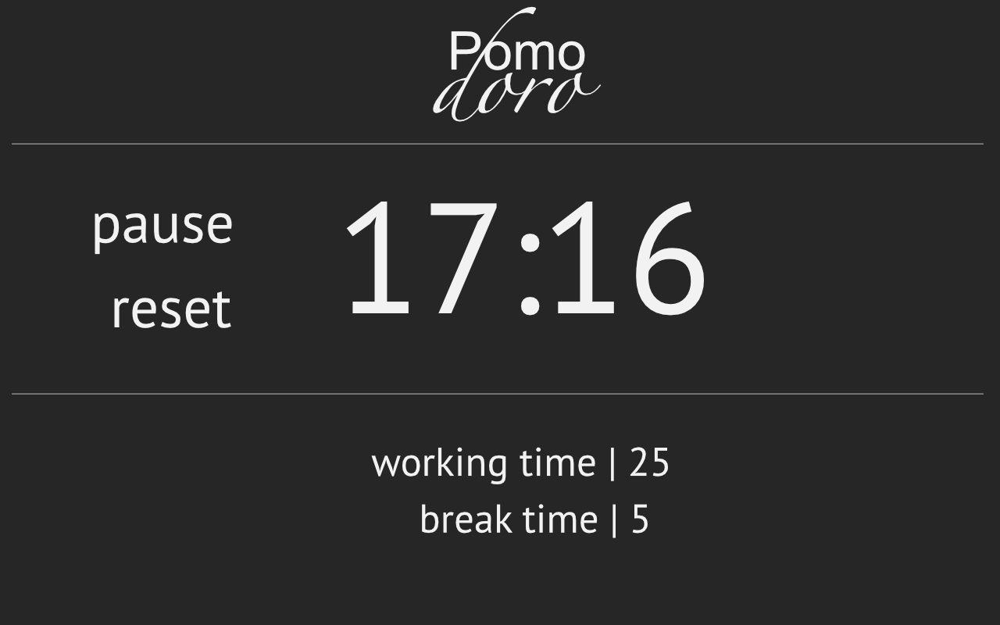
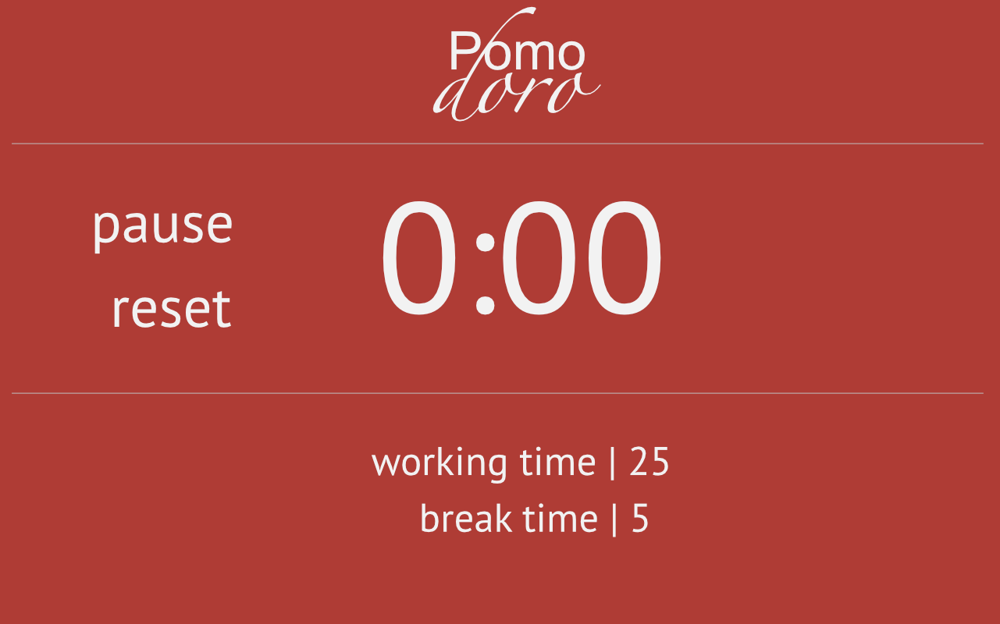
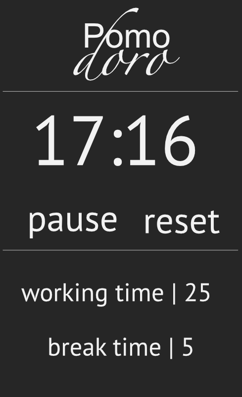

## Pomorodoro Timer
This is the fourth front-end project for freecodecamp.com. I am creating a Pomodoro Timer.

## Not yet hosted on Github

## Tools Used
jQuery, HTML and SASS/CSS

## User Stories
  * A user can start a 25 minute pomodoro, and the timer will go off once 25 minutes has elapsed
  * A user can reset the clock for the next pomodoro
  * A user can customize the length of each pomodoro

## Wireframes

